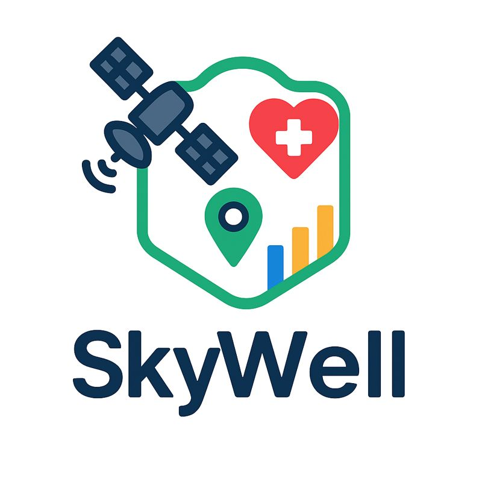
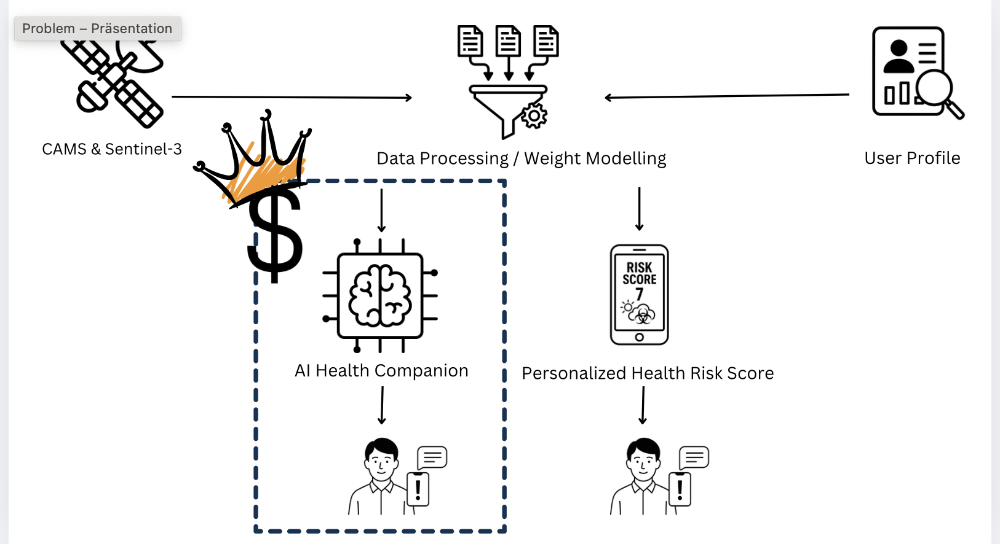

# SkyWell



This project is a smart, AI-powered pipeline that processes satellite weather data and personal user information to deliver **personalized weather alerts**. Whether it's high pollen count or a stormy afternoon, our system ensures that users receive timely, tailored forecasts based on both environmental data and their specific sensitivities or preferences.

## 🔍 Overview

We combine **satellite data** with **user-specific health profiles** to create a system that goes beyond generic forecasts. The goal is to prevent avoidable exposure to weather-related health triggers, such as:
- High pollen levels for allergy sufferers
- Sudden temperature changes for chronic disease patients
- Air quality warnings for sensitive individuals

## 🔧 How It Works

1. **Data Collection**  
   Satellite and environmental data are continuously collected (e.g., temperature, pollen count, air pressure).

2. **Data Processing**  
   Raw data is filtered and structured using a preprocessing pipeline.

3. **User Input**  
   Users input personal health information such as allergies, chronic diseases, or preferences.

4. **AI Modeling**  
   An AI model processes both environmental data and user profiles to predict personalized impacts.

5. **Forecast Display**  
   General forecasts are displayed on users' mobile devices.

6. **Personalized Alerts**  
   If the AI model identifies any risk based on the user's profile, a tailored notification is sent to their mobile device.

---

## 🧠 Architecture Diagram



---

# 👩‍💻 Developer Guide

## Mock Data Visualization

The interactive map (`mock_visualization.py`) uses **mock data** to demonstrate the risk score calculation and visualization pipeline:
- Mock UV and pollen data are generated for a grid over Berlin for several days.
- A user-weighted "Risk Score" (1-10) is calculated for each grid cell, combining UV and pollen values.
- The map displays colored rectangles for each cell, with popups showing the risk score, raw values, weights, and location.
- This allows rapid prototyping and UI/UX development without requiring real data or API access.

To run the mock visualization locally:
```bash
pip install -r requirements.txt
python mock_visualization.py
open data/interactive_map.html  # or open the file in your browser
```

## Real Data with Copernicus Jupyter Notebook

To fetch and visualize **real Copernicus data**, use the provided Jupyter notebook (`get_real_uv_pollen_satellite_data.ipynb`).

### Steps:
1. **Get your Copernicus API credentials:**
   - Register at https://cds.climate.copernicus.eu/
   - Find your UID and API key in your account settings.
   - Create a `.cdsapirc` file with:
     ```
     url: https://cds.climate.copernicus.eu/api/v2
     key: <YOUR-UID>:<YOUR-API-KEY>
     ```
2. **Go to the Copernicus ADS Toolbox JupyterLab:**
   - https://ads.atmosphere.copernicus.eu/toolbox
   - Start a JupyterLab session.
3. **Upload your `.cdsapirc` file** to your JupyterLab home directory (`/home/jovyan/`).
4. **Upload the notebook `get_real_uv_pollen_satellite_data.ipynb`.**
5. **Install required packages** (if needed) by running this in a notebook cell:
   ```python
   !pip install cdsapi xarray numpy matplotlib
   ```
6. **Run the notebook cells in order.**
   - The notebook will fetch UV and pollen forecast data for Berlin (5-day window), calculate the risk score, and plot the results.
   - You can adjust the user weights in the first code cell to match your profile.

### Data Processing Concept (Coming Soon)

The repository also includes a conceptual data processing prototype:  
**`skywell_concept_data_processing.py`**

- This file demonstrates the planned approach for personalized health risk scoring based on environmental data and user health profiles.
- It uses mock thresholds, weights, and a sample user profile ("Claudia") to show how different environmental factors (e.g., PM2.5, pollen, UV) could be combined into a single risk score.
- The script is implemented as a Streamlit app for interactive exploration and prototyping.
- **Note:** This is a conceptual mockup for internal ideation and is not intended for external developer use yet. The full data processing pipeline is under development and will be released in a future update.

## Notes
- The mock map is for demonstration and prototyping only; real data requires Copernicus API access.
- The Jupyter notebook is portable and can be shared or reused by anyone with Copernicus credentials.
- For more advanced analysis or visualization, extend the notebook as needed.

---

## Setup

1. Install the required dependencies:
```bash
pip install -r requirements.txt
```

2. Set up Copernicus Climate Data Store (CDS) API:
   - Register at https://cds.climate.copernicus.eu/
   - Create an API key
   - Create a file `~/.cdsapirc` with your API key:
   ```
   url: https://cds.climate.copernicus.eu/api/v2
   key: YOUR-API-KEY
   ```

## Usage

Run the data pipeline:
```bash
python data_pipeline.py
```

The script will:
1. Fetch UV and pollen data for Berlin
2. Process the data
3. Save the results in the `data` directory

## Notes

- The current implementation focuses on Berlin (coordinates: 52.5200°N, 13.4050°E)
- The data pipeline is set up to fetch both real-time and forecast data
- The processed data is saved in CSV format for easy access

## Next Steps

1. Implement proper data processing based on actual Copernicus dataset structure
2. Add more advanced visualization or interactivity
3. Integrate with user-facing applications or machine learning models
4. Extend to cover all of Europe 
